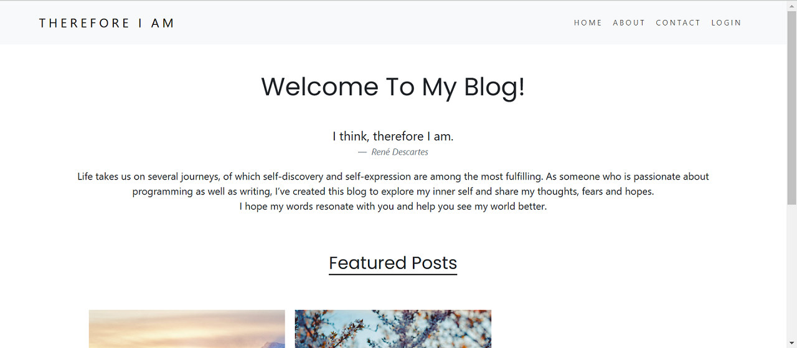
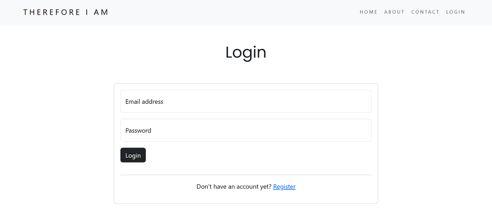
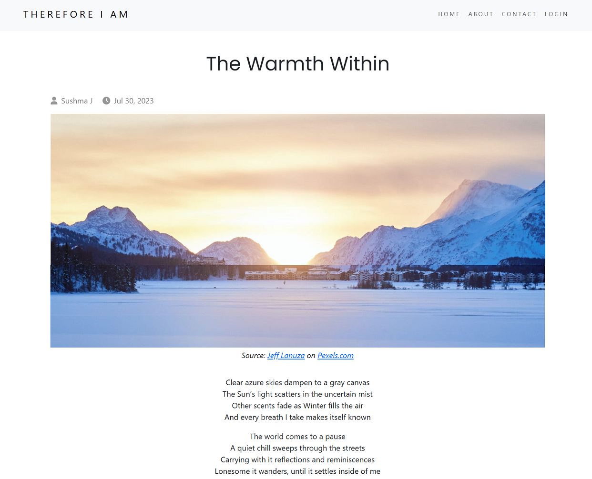

# Blog Website
A full-stack blog web application built using the following:

- Front-end: EJS with Bootstrap
- Back-end: Node.js with Express.js
- Cloud database: MongoDB Atlas
- Cloud image storage: Cloudinary
- Cloud host: Render

## Snapshots

## Run Locally
1. Clone the repository and install dependencies: `npm install`
1. Start the server: `npm run start`
1. Navigate to `localhost:3000` in your browser

